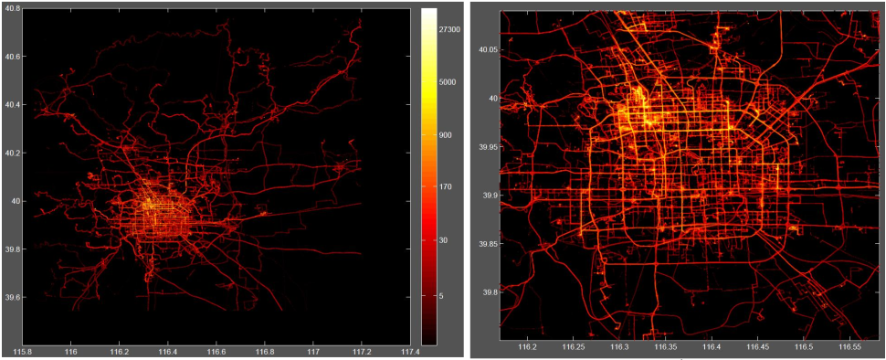

## 1. Our Contributions

### 1.1 Mission 
Data pre-processing to detect anomoulous users <br>
Paper: https://doi.org/10.1145/3380970

### 1.2 Approach
1. Heatmaps for each user
2. Creates keras layers of image representation of heatmaps
3. Incorporate Training Data and Verfification set
4. Train LSTM Model

### 1.3 Results
Todo, include relavent graph and information.

Goal: public dataset when we have some results and data visualization

## 2. Data Description

This GPS trajectory dataset was collected in (Microsoft Research Asia) Geolife project by 182 users in a period of over five years
(from April 2007 to August 2012). A GPS trajectory of this dataset is represented by a sequence of time-stamped points, each of
which contains the information of latitude, longitude and altitude. This dataset contains 17,621 trajectories with a total distance of
1,292,951 kilometers and a total duration of 50,176 hours. These trajectories were recorded by different GPS loggers and GPS-
phones, and have a variety of sampling rates. 91 .5 percent of the trajectories are logged in a dense representation, e.g. every 1~
seconds or every 5~10 meters per point.

This dataset recoded a broad range of users’ outdoor movements, including not only life routines like go home and go to work
but also some entertainments and sports activities, such as shopping, sightseeing, dining, hiking, and cycling. This trajectory
dataset can be used in many research fields, such as mobility pattern mining, user activity recognition, location-based social
networks, location privacy, and location recommendation.

Although this dataset is wildly distributed in over 30 cities of China and even in some cities located in the USA and Europe,
the majority of the data was created in Beijing, China. Figure 1 plots the distribution (heat map) of this dataset in Beijing. The
figures standing on the right side of the heat bar denote the number of points generated in a location. <p>

<center>
<b>A.</b> Data overview in Beijing &emsp;&emsp;&emsp;&emsp;&emsp;&emsp;&emsp; <b>B.</b> Within the 5th Ring Road of Beijing <p> <p> <b>Fig. 1:</b> Distribution of the dataset in Beijing city
</center>

The distributions of distance and duration of the trajectories are presented in Figure 2 and Figure 3.
In the data collection program, a portion of users have carried a GPS logger for years, while some of the others only have a
trajectory dataset of a few weeks. This distribution is presented in Figure 4 , and the distribution of the number of trajectories
collected by each user is shown in Figure 5.

## 3. Paper Citations

[1] Yu Zheng, Lizhu Zhang, Xing Xie, Wei-Ying Ma. Mining interesting locations and travel sequences from GPS trajectories. In
Proceedings of International conference on World Wild Web (WWW 2009), Madrid Spain. ACM Press: 791-800.

[2] Yu Zheng, Quannan Li, Yukun Chen, Xing Xie, Wei-Ying Ma. Understanding Mobility Based on GPS Data. In Proceedings of
ACM conference on Ubiquitous Computing (UbiComp 2008), Seoul, Korea. ACM Press: 312-321.

[3] Yu Zheng, Xing Xie, Wei-Ying Ma, GeoLife: A Collaborative Social Networking Service among User, location and trajectory.
Invited paper, in IEEE Data Engineering Bulletin. 33, 2, 2010, pp. 32-40.

## 4. Trajectory Data

Every single folder of this dataset stores a user’s GPS log files, which were converted to PLT format. Each PLT file contains a
single trajectory and is named by its starting time. To avoid potential confusion of time zone, we use GMT in the date/time
property of each point, which is different from our previous release.

PLT format:

> Line 1...6 are useless in this dataset, and can be ignored. 

Points are described in following lines, one for each line.

Field 1: Latitude in decimal degrees.

Field 2: Longitude in decimal degrees.

Field 3: All set to 0 for this dataset.

Field 4: Altitude in feet (-777 if not valid).

Field 5: Date - number of days (with fractional part) that have passed since 12/30/1899.

Field 6: Date as a string.

Field 7: Time as a string.

Note that field 5 and field 6&7 represent the same date/time in this dataset. You may use either of them.
```
Example:
> 39.906631,116.385564,0,492,40097.5864583333,2009-10-11,14:04:12;
```

## 5. Source

If you have any questions about this dataset, please contact Dr. Yu Zheng from Microsoft Research Asia.

Yu Zheng

Email: yuzheng@microsoft.com

[User Guide](https://www.microsoft.com/en-us/research/publication/geolife-gps-trajectory-dataset-user-guide/) 

[Download](https://www.microsoft.com/en-us/download/details.aspx?id=52367) 

Address: Microsoft Research Asia, Tower 2, No. 5 Danling Street, Haidian District, Beijing, P.R. China 100080

